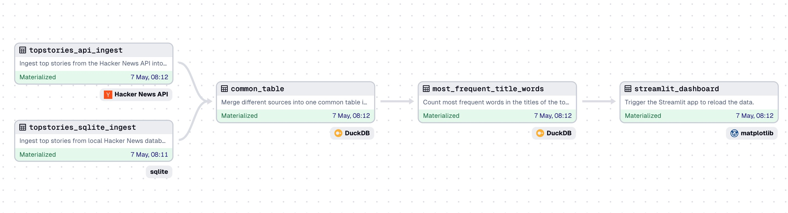
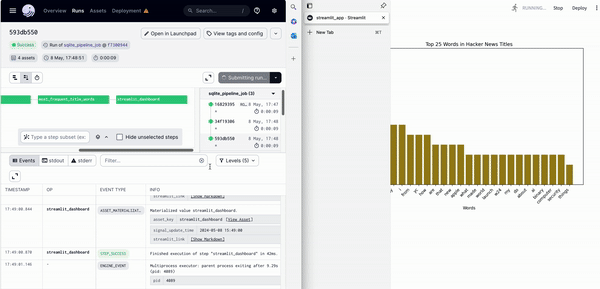

# 🚀 Building Data Engineering Pipelines with Dagster 🚀

This repository contains a demo project that shows how to build a simple end-to-end data engineering pipeline with Dagster. Dagster is an open source orchestrator designed for developing and maintaining data assets such as tables, datasets, machine learning models and reports (see https://github.com/dagster-io/dagster).
For this demo, imagine the following simplified but typical data engineering use case:
You want to follow the latest hacker news top stories (from Y Combinator) so you never miss a trend. Suppose you want to pull the data every hour from the official API (Ingest), then calculate the most frequent keywords (Transformation) and automatically update the dashboard (Serving + Analytics). 
Imagine, you also want to add a second data source (a database) from which you need to retrieve the data every 15 minutes. To avoid inserting duplicate trends, you calculate hashkeys based on predefined columns (e.g. trend titles) and only insert unique hashkeys.


To illustrate this, let's take a look at the data engineering lifecycle as described in “Fundamentals of Data Engineering” by Joe Reis and Matt Housley. In this picture, you can see “orchestration” as part of the undercurrents of the lifecycle. This is what Dagster is all about: orchestrating the right pipelines at the right time in the right order - fully automatically.


To test it, you just need to follow 3 simple steps and your entire local environment is set up, including local duckdb and sqlite database, dagster and a streamlit dashboard as frontend:
1. Clone the Github repository
2. Build the docker image
3. Run the docker image


## 📋 Prerequisites

Before you begin, ensure you have the following:

- **Docker**: To enable an easy setup, make sure to have Docker installed (e.g., via homebrew on Mac or via the official website: https://www.docker.com/get-started/).


## 🔨 Installation and Setup

Follow these steps to set up and run the demo:

1. **Clone the Repository**:
```bash
git clone <repository-url>
cd data_engineering_pipelines_with_dagster
```

2. **Build the Docker Image**:
```bash
docker build -t dagster_tutorial .
```

3. **Run the Docker Image in an Container**:
You will map the docker ports to your local ports, specifically the ones for the Dagster UI and the Streamlit Dashboard. By doing so, you can access the Dagster and Streamlit website from your local machine.
```bash
docker run -p 3001:3001 -p 8502:8502 dagster_tutorial
```

## 🏃 Running the Demo

Once set up, you can run the demo pipeline via the Dagster UI, which you can access via http://localhost:3001 in your browser. In a second browser tab, open http://localhost:8502 to see your Streamlit dashboard.
Once you have both windows open, click on the “Assets” tab and then click on “View global asset lineage” in the top right corner. Here you can take a look at your end-to-end pipeline.
It should look like this:



If you want to run the pipeline automatically, activate the schedules under http://localhost:3001/locations/orchestration/schedules. Once the pipeline has run end-to-end, you should notice an update of the bar chart (with the trending hacker news title keywords) in the streamlit dashboard (see animated GIF).



## 🤝 Contributing

Contributions to this demo are welcome. Please ensure that your code adheres to the best practices for Dagster.

## 📜 License

This project is licensed under the Apache License 2.0 - see the [LICENSE](LICENSE) file for details.

## 📞 Contact
Such a project can be as complicated as you want it to be, with integrating Snowflake, Databricks, DBT, Azure Service Principles, etc. If you have any questions, make sure to reach out!

- Tobias Zeulner - t.zeulner@reply.de

Machine Learning Reply,
Luise-Ullrich Str 14,
80636 Munich